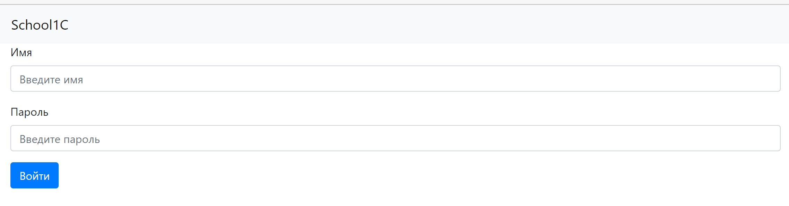
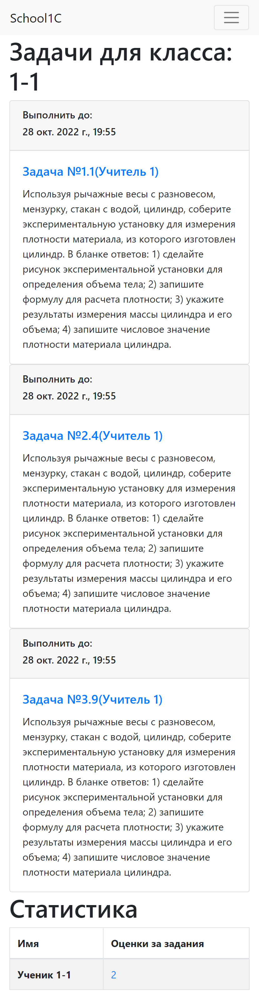
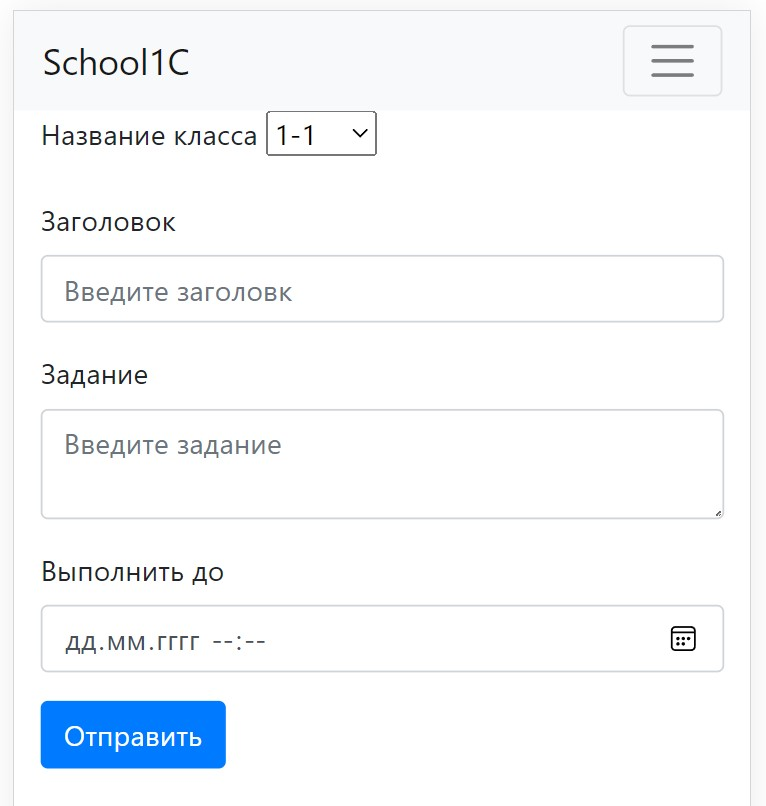
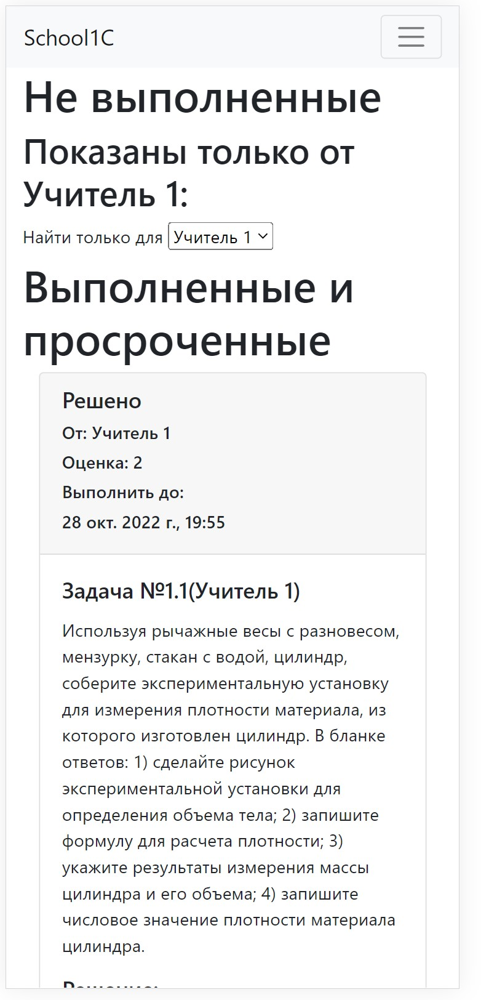
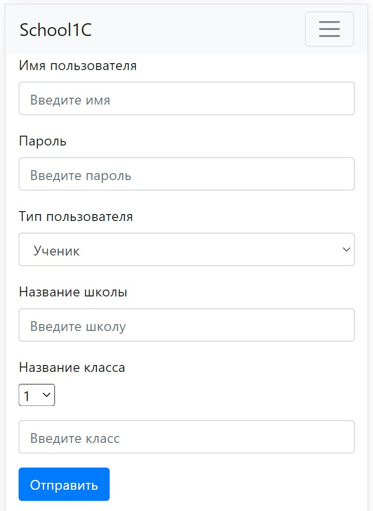
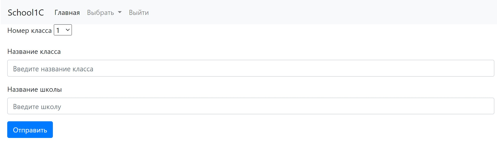
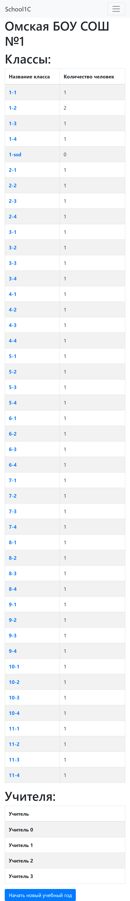

# SchoolC
# Школьный проект. Электронный дневник и журнал.
## Реализованы функции:
- Регистрация пользователей (несколько ролей: ученики, учителя, операторы)
- Добавления заданий
- Решение заданий
- Оценка заданий
- Фильтрации заданий по предметам
- Просмотр информации о классах и школах
- Перепривязки учеников и учителей к классам
- Начало нового учебного года
- Вывод статистики по классам и предметам
- И прочее
## Использованные технологии
 - ЯП: Java, JavaScript, HTML, CSS
 - Сборка: Maven
 - WEB: Spring-Boot (Spring Security)
 - ORM: Spring-Data JPA
 - DBMS: PostgreSQL
 - Template Engine: Thymeleaf
 - Tests: JUnit, Mockito
### Частичная реализация фронтенда на React & TypeScript: https://github.com/MalykhSergey/school1c-react.
## Cкриншоты
### Страница входа

### Задачи класса (мобильная версия)
</img>
### Добавить задачу (мобильная версия)
</img>
### Задачи ученика (мобильная версия)
</img>
### Создать пользователя (мобильная версия)
</img>
### Создать класс (мобильная версия)
</img>
### О классе (мобильная версия)
</img>
